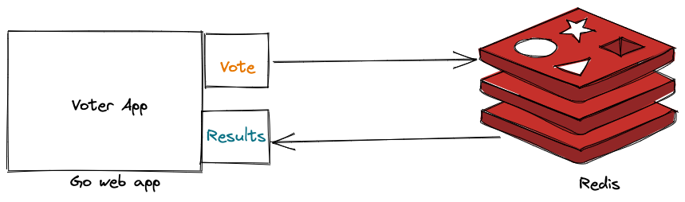

# voter-app

[](https://github.com/slashpai/voter-app/actions?query=workflow%3Abuild)
[](https://github.com/slashpai/voter-app/actions?query=workflow%3Ago-lint)
[](https://github.com/slashpai/voter-app/actions?query=workflow%3Amd-links)

This is a simplified version of [example-voting-app](https://github.com/dockersamples/example-voting-app) written in go.
This app lets you vote any number of times. This is not an example for properly architected app but created to show how containers can be utilized for multi-tier applications.

## Architecture



## Pre-requisite

Redis running in system as standalone or as container. Set environment variables accordingly while running app as standalone or as a container.

```go
docker run -d -p 6379:6379 --name redis_voter redis:alpine
```

## Build locally

From the location of clonned repo

```
make build-local
```

Set environment variables, update the values accordingly as per your redis setup

```bash
export VOTER_REDIS_ADDR="localhost:6379"
export VOTER_REDIS_DB=0
export VOTER_REDIS_PASSWORD=""
```

```go
./voter-app
```

## Build docker image

```go
DATE=$(date +"%Y%m%d")
docker build . -t voter-app:$DATE
```

### Run as container

Example shown below with both redis and voter app running as container. Note `--link` option where redis container address is specified.
```go
docker run -p 8090:8080 --env VOTER_REDIS_ADDR="redis_voter:6379" --link redis_voter --env VOTER_REDIS_PASSWORD="" --env VOTER_REDIS_DB=0 voter-app:$DATE
```

Go to [http://localhost:8080](http://localhost:8080) to access the application


## Using docker-compose

This will build the image and setup the voter-app stack with come command.

```
docker-compose up
```

Go to [http://localhost:8090](http://localhost:8090) to access the application

## Contributing

* Fork the project on GitHub
* Clone the project
* Add changes (and tests if applicable)
* Commit and push
* Create a pull request

## TODO

* Add tests

## License

[Apache License](LICENSE)
